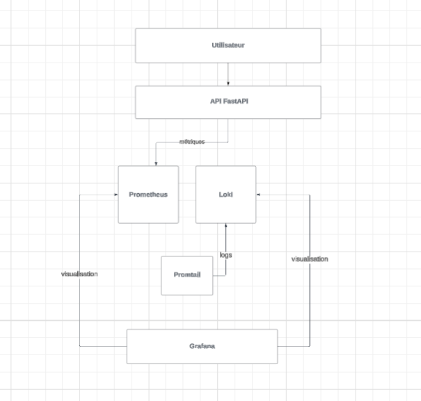
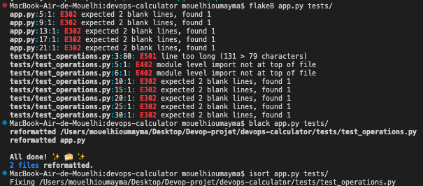

# 🧮 DevOps Calculator API

Une API REST simple de calculatrice (addition, soustraction, multiplication, division), développée avec **FastAPI**, testée avec **pytest**, et automatisée avec **GitHub Actions**.

---

# Sommaire

1. [Guide d'installation local](#guide-dinstallation-local)
2. [Lancer le projet](#lancer-le-projet)
   1. [Docker](#pour-lancer-le-projet-avec-docker)
   2. [Autre option disponible pour lancer le projet](#autre-option-disponible-pour-lancer-le-projet)
3. [Points de terminaison (Endpoints)](#points-de-terminaison-endpoints)
4. [Fonctionnalites](#fonctionnalites)
5. [Architecture du projet](#architecture-du-projet)
6. [Choix techniques](#choix-techniques)
7. [Schemas d'architecture](#schemas-darchitecture)
8. [Bonus](#bonus)
   1. [Qualite de code : SonarQube, linters, formatters](#qualite-de-code-sonarqube-linters-formatters)
   2. [Tests avances : Tests d'integration, E2E, tests de charge](#tests-avances-tests-dintegration-e2e-tests-de-charge)

###################################################################
## ⚙️ Guide d’installation local
###################################################################

``` bash
git clone https://github.com/Quegrec/devops_calculator.git
cd devops_calculator
python -m venv venv

```
## Pour lancer le projet avec Docker, merci de lancer Docker et d'utiliser la commande suivante :
---
Sur Windows :
``` bash
.\bin\start.bat
```

Sur macOS / Linux :
``` bash
.\bin\start.sh
```
Cela installera les dépendances nécessaires au projet et lancera automatiquement le conteneur Docker.

## Autre option disponible pour lancer le projet 
---
* Lancer le projet : 

``` bash
Pour exécuter API de calculatrice, suivez les étapes suivantes :
  1. Installez les dépendances requises. Vous pouvez utiliser `pip` pour installer les
  dépendances listées dans le fichier `requirements.txt` :

  pip install -r requirements.txt

  2. Démarrez le serveur en exécutant la commande suivante :

  uvicorn app:app --reload

  Le serveur sera accessible à l’adresse http://localhost:8000.

```
* Lancer les tests : 
``` bash
pytest
```

* Déploiement via Docker
```
docker build -t devops_calculator .
docker run -d -p 8000:8000 devops_calculator
```

---


## Points de terminaison (Endpoints)

  Les points de terminaison suivants sont disponibles dans l'API :
  ### `/`
  - Méthode : GET
  - Description : Point de terminaison principal qui retourne un message simple à propos
  de l’API de calculatrice.
  - Exemple de réponse :
  {"result": "Ceci est une API de calculatrice simple"}

    ### `/add`
    - Méthode : GET
    - Description : Effectue l’addition de deux nombres.
    - Paramètres de requête :
    - `a` (entier) : Le premier nombre.
    - `b` (entier) : Le second nombre.
    - Exemple de requête : http://localhost:8000/add?a=2&b=3
    - Exemple de réponse :
        {"result": 5}

    ### `/subtract`
    - Méthode : GET
    - Description : Effectue la soustraction de deux nombres.
    - Paramètres de requête :
    - `a` (entier) : Le premier nombre.
    - `b` (entier) : Le second nombre.
    - Exemple de requête : http://localhost:8000/subtract?a=5&b=2
    - Exemple de réponse :
        {"result": 3}

    ### `/multiply`
    - Méthode : GET
    - Description : Effectue la multiplication de deux nombres.
    - Paramètres de requête :
    - `a` (entier) : Le premier nombre.
    - `b` (entier) : Le second nombre.
    - Exemple de requête : http://localhost:8000/multiply?a=4&b=5
    - Exemple de réponse :
        {"result": 20}

    ### `/divide`
    - Méthode : GET
    - Description : Effectue la division de deux nombres.
    - Paramètres de requête :
    - `a` (entier) : Le premier nombre.
    - `b` (entier) : Le second nombre.
    - Exemple de requête : http://localhost:8000/divide?a=10&b=2
    - Exemple de réponse :
        {"result": 5}

    Remarque : Si le second nombre (diviseur) est égal à zéro, une réponse d'erreur sera
    retournée :
        {"error": "Impossible de diviser par zéro."}


---

<br><br>

###################################################################
## 🚀 Fonctionnalités
###################################################################
  - Addition, soustraction, multiplication, division via requêtes GET
  - Gestion des erreurs (ex : division par zéro)
  - Couverture de tests automatisés avec pytest
  - Intégration continue via GitHub Actions
  - Déploiement simple avec Docker
  - Monitoring prévu via Prometheus & Grafana

---
<br><br>

###################################################################
## 🏗️ Architecture du projet
###################################################################
```text 
📁 Projet
 ├── 🐍 app.py # API FastAPI principale 
 ├── 🧪 tests/ │ 
  └── test_operations.py # Tests unitaires avec pytest 
 ├── 📦 requirements.txt # Dépendances Python
 ├── 🐳 Dockerfile # Image Docker pour l'API 
 ├── 🧩 docker-compose.yml # Orchestration basique de l'API ├── 🔧 .github/ │ 
   └── workflows/ │ 
    └── ci.yml # Pipeline CI GitHub Actions 

├── docker-compose.yml # Orchestration des services de  

├── 📊 monitoring/ # Stack de monitoring (Prometheus, Grafana, Loki, etc.) 
    └── prometheus.yml # Configuration de Prometheus │
    ├── loki-config.yml # Configuration de Loki pour les logs ├── promtail-config.yml # Configuration de Promtail (agent collecteur de logs) 
    └── nginx/ # (Optionnel) config Nginx à monitorer ou exposer 
```


| Fichier/Dossier                      | Rôle                                                                                          |
|--------------------------------------|-----------------------------------------------------------------------------------------------|
| `app.py`                             | Code principal de l'API FastAPI avec les endpoints (`/add`, `/subtract`, etc.).              |
| `requirements.txt`                   | Dépendances Python nécessaires à l'application.                                               |
| `Dockerfile`                         | Image Docker de l'application avec installation des dépendances et lancement Uvicorn.         |
| `docker-compose.yml`                | (À la racine) Orchestration de l’API uniquement.                                              |
| `monitoring/`                        | Regroupe tous les fichiers de configuration pour la stack d’observabilité.                   |
| `monitoring/docker-compose.yml`     | Lance Prometheus, Grafana, Loki, Promtail, etc. ensemble.                                     |
| `monitoring/prometheus.yml`         | Configuration de Prometheus pour le scraping des métriques de l'API.                         |
| `monitoring/loki-config.yml`        | Configuration de Loki pour la collecte et l’indexation des logs.                             |
| `monitoring/promtail-config.yml`    | Configuration de Promtail pour lire les logs du conteneur et les envoyer à Loki.             |
| `monitoring/nginx/`                 | Contient la config du reverse proxy ou des métriques exposées pour Nginx (optionnel).        |
| `tests/`                             | Répertoire contenant les tests unitaires.                                                     |
| `.github/workflows/ci.yml`          | Pipeline CI/CD avec GitHub Actions (tests automatiques à chaque push/PR).                    |
   


---

<br><br>
###################################################################
## ⚙️ Choix techniques
###################################################################

| Technologie        | Rôle dans le projet                                                              | Raisons du choix                                                                      |
|--------------------|----------------------------------------------------------------------------------|----------------------------------------------------------------------------------------|
| **FastAPI**        | Framework web principal pour construire l’API                                   | Très rapide, asynchrone, supporte OpenAPI/Swagger automatiquement, facile à utiliser |
| **Uvicorn**        | Serveur ASGI utilisé pour exécuter FastAPI                                       | Léger, rapide et conçu pour les applications asynchrones                             |
| **pytest**         | Framework de test pour vérifier les fonctionnalités                              | Facile à écrire, lisible, très répandu dans la communauté Python                     |
| **GitHub Actions** | Intégration continue (CI) pour lancer automatiquement les tests à chaque push/PR | Gratuit, intégré à GitHub, rapide à configurer pour les projets open source          |
| **Docker**         | Conteneurise l'application pour assurer la portabilité                           | Permet de déployer le projet de façon uniforme sur tout environnement                |
| **Docker Compose** | Orchestration locale des conteneurs (API, services futurs)                       | Simplifie le lancement multi-services (utile pour Prometheus, Grafana, etc.)         |
| **Prometheus**     | Monitoring des métriques API (latence, erreurs, etc.)                            | Collecte efficace de métriques via HTTP, très utilisé dans les systèmes DevOps       |
| **Grafana**        | Visualisation graphique des métriques Prometheus                                 | Interface puissante pour dashboards temps réel                                       |


<br><br>
###################################################################
## ⚙️ Schémas d'architecture
###################################################################





<br><br>

###################################################################
# BONUS
###################################################################
## Qualité de code : SonarQube, linters, formatters

| Outil            | Rôle                                                          | Commande (exemple)                      |
|------------------|---------------------------------------------------------------|------------------------------------------|
| **SonarQube**    | Analyse de qualité de code : détection de bugs, duplications, complexité, etc. | Intégration possible via GitHub Actions ou Docker |
| **Flake8**       | Linter Python : signale les erreurs de style (PEP8), variables inutilisées, etc. | `flake8 app.py tests/`                  |
| **Black**        | Formatter Python automatique pour uniformiser le style        | `black app.py tests/`                   |
| **isort**        | Trie automatiquement les imports Python                       | `isort app.py tests/`                   |
| **mypy** (optionnel) | Vérification de types statiques si annotations sont utilisées | `mypy app.py`                        |

---

### Installation


``` bash
pip install flake8 black isort

```
- Formatage et vérification rapide:
    # Vérifie les erreurs de style
    flake8 app.py tests/

    # Reformate automatiquement le code
    black app.py tests/
    isort app.py tests/




## Tests avancés : Tests d'intégration, E2E, tests de charge
```text
tests/
├── test_operations.py             ✅ Tests unitaires (ton fichier actuel)
├── integration/
│   └── test_sequence_operations.py ✅ Tests enchaînés (add → divide)
├── e2e/
│   └── test_end_to_end.py         ✅ Requêtes httpx sur serveur live

```
